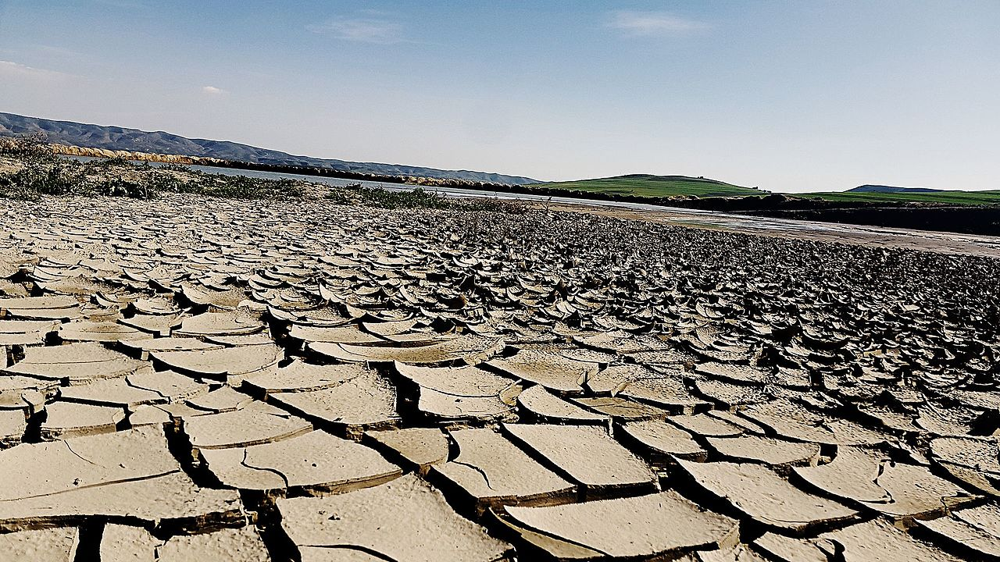
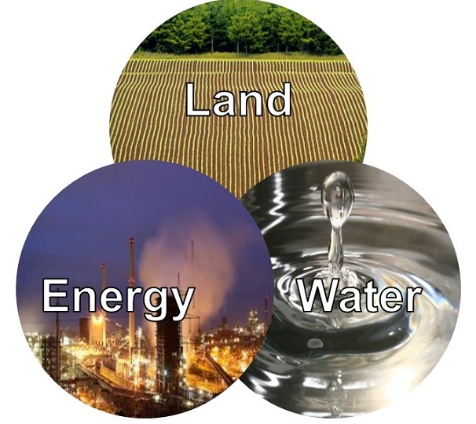
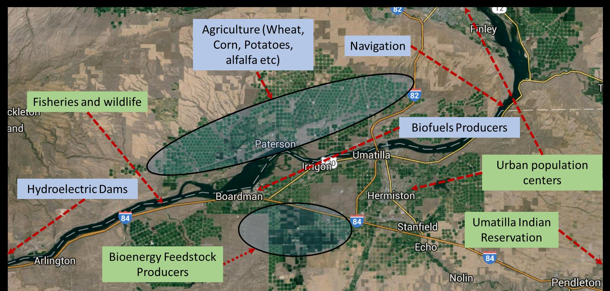
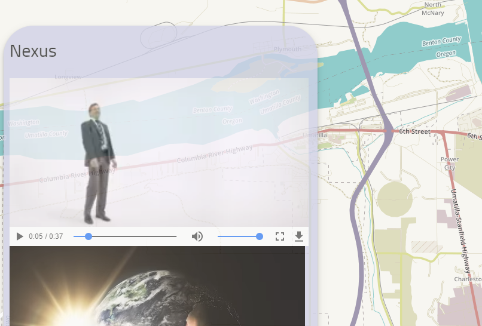
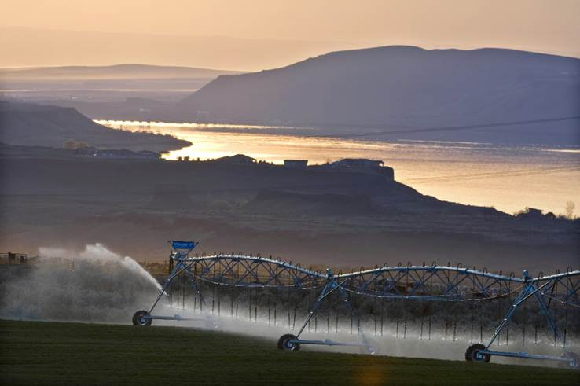

# lab5storymap
## [InterACTWEL](https://farahanimajid.github.io/lab5storymap/)

**Story map**| **May 22, 2018** | **InterACTWEL** | **Contributors:** 
[Majid Farahani](https://github.com/farahanimajid)


InterACTWEL is a computer-aided decision support tool that is being 
developed to empower land, water, energy managers and food producers 
to envision and plan towards a resilient future for their local
 communities. It will help communities identify decisions for
  long-term adaptation to changes that they do not have control 
  of, such as a severe water restriction or changing state laws.
   To make this tool successful, we need to hear from water, energy
    managers, and food producers about their current and future 
    management concerns and the types of information needed to
     make more informed management decisions and long-term plans.

 ### Set up the workspace
 The basic folder structure to generate a story map should be as follows:
   ```powershell
   lab5
       │index.html
       │readme.md
       ├─css
       ├─js
       ├─img       
       ├─assets
      
            
          
   ```

### Required Libraries
In the head element we insert the required css and javascript libraries

```powershell
     <!--add required stylesheets-->
       <!--leaflet css-->
       <link rel="stylesheet" href="https://cdnjs.cloudflare.com/ajax/libs/leaflet/1.2.0/leaflet.css">
       <link rel="stylesheet" href="https://unpkg.com/leaflet@1.2.0/dist/leaflet.css" />
       <link rel="stylesheet" href="https://maxcdn.bootstrapcdn.com/bootstrap/3.3.7/css/bootstrap.min.css">
       <link rel="stylesheet" href="https://cdnjs.cloudflare.com/ajax/libs/twitter-bootstrap/3.3.7/css/bootstrap.min.css">
       <link rel="stylesheet" href="https://unpkg.com/leaflet@1.2.0/dist/leaflet.css">
       <link rel="stylesheet" href="https://cesiumjs.org/releases/1.31/Build/Cesium/Widgets/widgets.css">
       <link href="https://fonts.googleapis.com/css?family=Lobster|Open+Sans" rel="stylesheet">
       <link rel="stylesheet" href="css/color.css">
       <!--Google Font-->
       <link href="https://fonts.googleapis.com/css?family=Cairo" rel="stylesheet">
       <!--add favicon for the web page-->
       <link rel="shortcut icon" href="img/favicon (1).ico" type="image/x-icon">
   
       <!--facebook and info icons-->
       <link rel="stylesheet" href="https://cdnjs.cloudflare.com/ajax/libs/font-awesome/4.7.0/css/font-awesome.min.css">
       <!--animation-->
       <link rel="stylesheet" href="https://cdnjs.cloudflare.com/ajax/libs/animate.css/3.5.2/animate.min.css">
   
       <!--Font-->
       <link href="https://fonts.googleapis.com/css?family=Cairo" rel="stylesheet">
   
       <link rel="stylesheet" type="text/css" href="css/storymap.2.3.css">
       <link rel="shortcut icon" href="img/favicon.ico" type="image/x-icon">
       <!--add required libraries-->
       <script src="https://unpkg.com/leaflet@1.2.0/dist/leaflet.js"></script>
       <script src="https://cdnjs.cloudflare.com/ajax/libs/leaflet/1.2.0/leaflet.js"></script>
       <script src="https://ajax.googleapis.com/ajax/libs/jquery/3.1.1/jquery.min.js"></script>
       <script src="https://cdnjs.cloudflare.com/ajax/libs/jquery/3.2.1/jquery.min.js"></script>
       <script src="https://maxcdn.bootstrapcdn.com/bootstrap/3.3.7/js/bootstrap.min.js"></script>
       <!--leaflet.ajax for asynchronously adding geojson data-->
       <script src="https://cdnjs.cloudflare.com/ajax/libs/leaflet-ajax/2.1.0/leaflet.ajax.min.js"></script>
       <script src="https://cesiumjs.org/releases/1.31/Build/Cesium/Cesium.js"></script>
       <!--boostrap-->
       <script src="https://cdnjs.cloudflare.com/ajax/libs/twitter-bootstrap/3.3.7/js/bootstrap.min.js"></script>
       <!--mini globle map-->
       <script src="https://cdnjs.cloudflare.com/ajax/libs/d3/3.5.5/d3.min.js"></script>
       <script src="https://cdnjs.cloudflare.com/ajax/libs/topojson/1.6.19/topojson.min.js"></script>
       <script src="js/globeminimap.js"></script>
   
   
       <!--story map plugin-->
       <script src="js/storymap.2.3.js"></script>
            
          
   ```

###  The storyline
We use 7 different sections

##### section 1: overview

In this section we use a video (WEF.mp4)
 ``` html
  <section data-scene="overview" data-background="assets/WEF.mp4">
                <div class="fullscreen text-center">
                    <h1 style="color: rgb(254,196,79)"> <b>InterACTWEL</b></h1>
                    <h1>
                        <small style="color: rgb(255,247,188)"> Interactive Adaptation and Collaboration Tool for managing Water, Energy and Land
                        </small>
                    </h1>
                    <br/><br/><br/><br/><br/><br/><br/><br/><br/><br/><br/><br/><br/>
                    <div class="credit">
                        <p></p> <br/><br/><br/>
                        <p style="color: rgb(255,247,188)" align="right"> Created by Majid Farahani From Oregon State University,2018 </p>
                    </div>
               </div>
                <br/><br/><br/>

            </section>
 ```
 
 
 
##### section 2: FEW

In this section we talk about problem and use 2 images for the scene called FEW 
 
 
 
 
 ```
<section data-scene="FEW">
                <h2 style="color: #045a8d" align="left" ><b>InterACTWEL </b></h2>
                <p align="justify">
                    Unexpected changes and disturbances can threaten consistent availability and quality of shared natural resources (e.g., water, energy, and land)
                    <br/>
                    
                    <br/><br/>
                    <br/>
                    
                    <br/><br/>
                    During the 2012-2017 California drought period, in spite of substantial cuts to surface water supplies, famers were able to show strong growth trend by
                    shifting to groundwater,
                    growing higher-value crops,
                    growing crops more suited to local climates, and
                    adopting to water-saving technologies like drip irrigation.
                    However, the increased use of groundwater has led to dangerously low levels in groundwater reservoirs.
                    This shifts the burden to future generations, who may have to dig deeper and more wells
                    Places like Tulare County, CA have had significant well failures during the drought, forcing many farmworkers to leave the state and travel to Oregon and Washington to find enough work
                </p>
                <p>
                    <strong>Threats affect Resiliency of Food, Energy, and Water sectors in local communities</strong>

                </p>
                <p align="justify">
                    Over time, water, energy, and land resources impaired by threats could make it challenging for our local food, energy, and water sectors to absorb unexpected changes and retain function
                    As a result, future changes may significantly challenge the levels of service provided by these sectors


                </p>
                <p align="justify">
                So, we need to develop a secure decision support system for coordination of adaptation planning among food, energy, and water actors
                </p>
            </section>
 ```

##### section 3: FEW2 
talk about the reasons of using InterACTWEL
 
```html
<section data-scene="FEW2">
                <h2 style="color: #045a8d" align="left" ><b>Why we need InterACTWEL </b></h2>


                    InterACTWEL is a computer-aided decision support tool that is being developed to empower land, water,
                    energy managers and food producers to envision and plan towards a resilient future for their local
                    communities. It will help communities
                    identify decisions for long-term adaptation to changes that they do not have control of, such as a
                    severe water restriction or changing state laws.
                    To make this tool successful, we need to hear from water, energy managers, and food producers
                    about their current and future management concerns and the types of information needed to make more
                    informed management decisions and long-term plans.

                </p>
                
                <br/><br/>
                <br/>

                <p align="justify">
                    Because natural resources are limited, many communities need assistance to effectively coordinate demand,
                    allocation and efficient use of water, energy and land. Coordination among stakeholders is especially
                    critical when resource availability and quality is threatened. Stakeholders may include those whose
                    livelihoods depend on food and energy production, as well as availability of water for consumptive
                    uses (e.g., industry, agriculture, drinking water) as well as non-consumptive uses (e.g., fisheries,
                    ecosystem maintenance, recreation, navigation, hydropower, cultural preservation). Food-Energy-Water
                    (FEW) actors often include farmers, tribes, water managers, dam operators, industries, recreationalists,
                    government agencies and environmentalists. InterACTWEL is a computer-aided decision support tool that
                    empowers FEW actors to envision and plan towards a resilient future for their local communities. Unlike
                    other tools that focus on the short-term decision-making, InterACTWEL in a long-term planning tool that
                    help communities be more resilient to changes that they do not have control of, such as a severe water
                    restriction or changing state laws. Whenever there is an environmental disturbance (e.g., extreme floods,
                    droughts, groundwater declines, fish diseases) or when there are new agricultural or environmental policies,
                    FEW actors can use InterACTWELs intuitive interfaces to examine how these factors will affect their goals,
                    operations and livelihoods. The scientific models in InterACTWEL allow individual actors to identify
                    potential adaptation strategies from a wide range of management choices available to them, while also
                    enabling them to learn about how their decisions affect other FEW actors. With InterACTWEL local communities
                    of FEW actors can increase their overall capacity to adjust their operations through time, for uncertain
                    and adverse stresses affecting the environment or the economy. Anyone can use and access InterACTWEL; the
                    data-secure tool is easy to navigate and can run on either a desktop or mobile application. How it works:
                    InterACTWEL goes well beyond just being a web-based platform to share data and information among FEW actors
                    in a local region. The system contains advanced scientific models and interactive optimization algorithms
                    that can quickly synthesize and leverage the collective wisdom of FEW actors. The algorithms help identify
                    potential adaptation strategies, while also meeting environmental, economic and social sustainability goals.
                </p>
            </section>

```


##### section 4: FEW3
in this section we add the geojason files including watersheds and streams in Umatilla

```html
<h2 style="color: #045a8d" align="left" ><b>Actors</b></h2>
                <p align="justify">
                    InterACTWEL allows FEW actors to upload and connect their own trusted scientific models such as hydrologic,
                    economic or crop growth models for analyses of their sector. If a FEW actors model is overly complex, then
                    users can upload results from their own simulation models via a graphical user interface. The machine-learning algorithms
                    in InterACTWEL will then create fast surrogate models to represent the FEW actors system in the adaptation planning framework.
                    InterACTWEL is highly flexible. It allows individuals and groups to modify the decisions proposed by the optimization algorithms
                    while also accepting new information at any time. If FEW actors are unsatisfied with the scenarios for water and natural
                    resource use that InterACTWEL provides, then they can modify the scenarios, and the tool will adapt to the new preferences.
                    All of this is accomplished in a secure and trusted cyber environment. If a FEW actor is considering a potential strategy, it
                    can be kept private and not shared with other users. InterACTWEL is funded by the U.S. Department of Agriculture (USDA) National
                    Institute of Food and Agriculture (NIFA) via an interagency partnership between the National Science Foundation (NSF) and
                    USDA-NIFA.</p>
                    <br/>
                    
                    <br/><br/>


            </section>
```

##### section 5: FEW4

```html
 <section data-scene="FEW4">

                <h2 style="color: #045a8d" align="left" ><b>InterACTWEL</b></h2>
                <p align="justify">
                    InterACTWEL aims to help land, water, energy managers, and food producers identify long-term management options that respond to potential threats, and empower coordination of management efforts
                </p>
                <br/>
                
                <br/><br/>


            </section>
```

##### section 6: FEW5
A video from youtube  added to our scene and also another video was addresed using link


```html
<section data-scene="FEW5">
                <h2>Nexus</h2>
                <br/><span style="color: red "> </span>
                <video controls width="500px" class="embeded-photo">
                    <source src="assets/nexus.mp4" />
                </video>
                
                <!--<video controls width="500px" class="embeded-photo">
                    <source src="assets/Sustainability in the Water-Energy-Food Nexus.mp4" />
                </video>  -->
                <br/><br/><p>Sustainability in the Water-Energy-Food Nexus <a href="https://youtu.be/HKfCXOvaqbM">Youtube</a>.</p>
            </section>
```

##### section 7: END
In the last page we use the below code and also image

```html
 <section data-scene="end" data-background="img/water2.jpg">
                <div class="fullscreen text-center">
                    <br/>
                    <h1 class="">A secure decision support system for coordination of adaptation planning among Food, Energy, and Water actors in the Pacific Northwest</h1>
                    <h1>
                        <small style="color: rgba(255,255,255,0.95)">Download Storymap.js from
                            <a href="https://github.com/farahanimajid/lab5storymap"> <i><b>https://github.com/farahanimajid/lab5storymap </b></i> </a>
                        </small>
                    </h1>

                </div>
                <div class="credit">
                    <p></p> <br/><br/><br/>
                    <p>Created by Majid Farahani From Oregon State University</p>
                </div>
            </section>
```

## Defining layers

we introduce 3 different base map layers and also add data

```html

   var layers = {
        Stations: {
            layer: L.geoJson.ajax('http://mapious.ceoas.oregonstate.edu/geoserver/mapious/ows?service=WFS&version=1.0.0&request=GetFeature&typeName=ore_counties&outputFormat=application%2Fjson', {
                color: 'orange',
                weight: 2,
                opacity: 0.3
            })
        },
        Umatilla: {
            layer: L.geoJson.ajax('assets/umatilla.geojson', {
                color: 'red',
                weight: 2,
                opacity: 0.3
            })
        },
       Streams: {
           layer: L.geoJson.ajax('assets/Streams.geojson', {
               color: 'blue',
               weight: 2,
               opacity: 0.3
           })
       },
       Watersheds: {
           layer: L.geoJson.ajax('assets/watersheds.geojson', {
               color: 'blue',
               weight: 2,
               opacity: 0.3
           })
       },
        satellite: {
            layer: L.tileLayer('https://api.tiles.mapbox.com/v4/{id}/{z}/{x}/{y}.png?access_token=pk.eyJ1IjoiamFrb2J6aGFvIiwiYSI6ImNpcms2YWsyMzAwMmtmbG5icTFxZ3ZkdncifQ.P9MBej1xacybKcDN_jehvw', {
                id: 'mapbox.satellite'
            })
        },


       cartodb_dark: {layer:L.tileLayer('https://{s}.tile.openstreetmap.fr/hot/{z}/{x}/{y}.png', {
           maxZoom: 19,
           attribution: '&copy; <a href="http://www.openstreetmap.org/copyright">OpenStreetMap</a>, Tiles courtesy of <a href="http://hot.openstreetmap.org/" target="_blank">Humanitarian OpenStreetMap Team</a>'

       })}
    }
```
## Scenes
In next step we define scenes
```
 var scenes = {
        overview: {lat: 45.899522, lng: -119.305170, zoom: 9, name: 'Cover Page'},
        FEW: {lat: 44.312742, lng: -124.103032, zoom: 7, name: 'FEW',layers: ['Stations']},
        FEW2: {lat: 45.899522, lng: -119.305170, zoom: 9, name: 'FEW',layers: ['Stations']},
        FEW3: {lat: 45.899522, lng: -119.305170, zoom: 9, name: 'FEW3',layers: ['Umatilla', 'Streams', 'Watersheds', 'satellite'] },
        end: {lat: 45.899522, lng: -119.305170, zoom: 14, name: 'The End'}
    };
 ```
 
## Story map elements
 Finally define the story map elements
  ```
   $('#storymap').storymap({
         scenes: scenes,
         layers: layers,
         baselayer: layers.cartodb_dark,
         legend: true, // if you do not want a legend feature, you can simply not define the createLegend function.
         credits:  "Created by Majid Farahani, 2018",
         loader: true,
         scalebar: true,
         navwidget: true,
         flyto: false,
         scrolldown: true,
         progressline: true
          ```